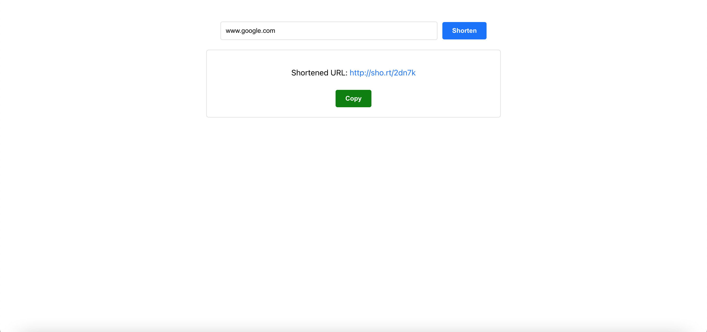

# DevProjects - Link shortener website

This is an open source project from [DevProjects](http://www.codementor.io/projects). Feedback and questions are welcome!
Find the project requirements here: [Link shortener website](https://www.codementor.io/projects/web/link-shortener-website-brqjanf6zq)

## Tech/framework used
Built with react

## Screenshots and demo

## Links
Site URL: https://LSrihith.github.io/URLShortner

## Installation

Follow these steps to install and run the project in your local development environment:

### Prerequisites

Before you begin, ensure you have met the following requirements:

- You have `node` and `npm` installed. You can download them from [Node.js website](https://nodejs.org/).

### Installing URLShortner

To install url-shortener, follow these steps:

1. Clone the repository:

git clone https://github.com/LSrihith/URLShortner.git

2. Navigate to the repository directory:
cd URLShortner

3. Install the project dependencies:
npm install

### Running url-shortener

To run url-shortener, execute the following command:
npm start

This will start the development server and open the application in your default web browser. By default, the local server runs at [http://localhost:3000](http://localhost:3000).

### Building the Project

To build the project for production, run the following command:
npm run build

This will create a `build` directory with a production build of your app.

## License
[MIT](https://choosealicense.com/licenses/mit/)
Most open source projects use the MIT license. Feel free to choose whichever license you prefer.
